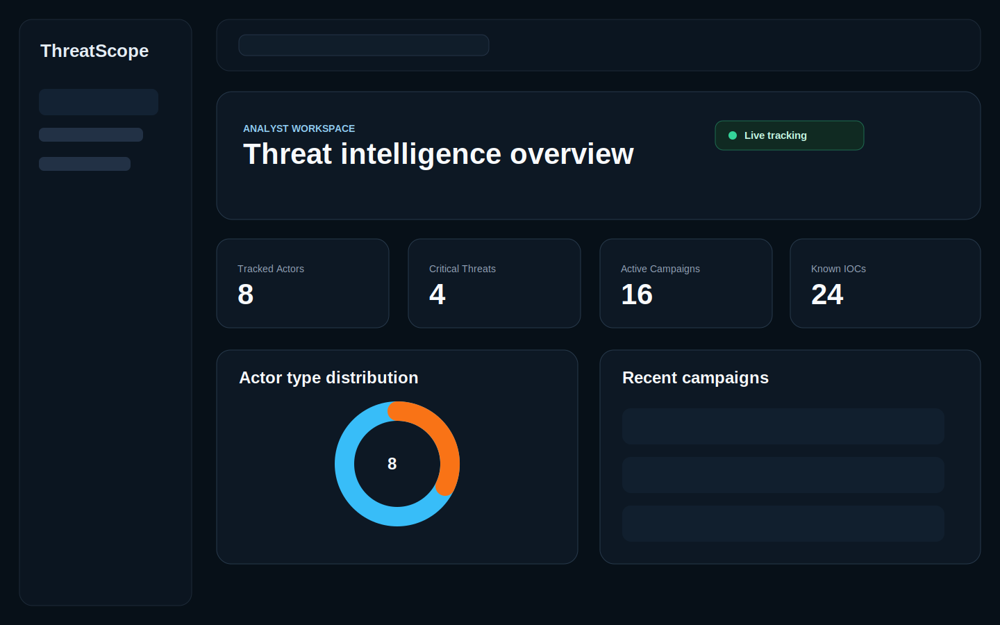
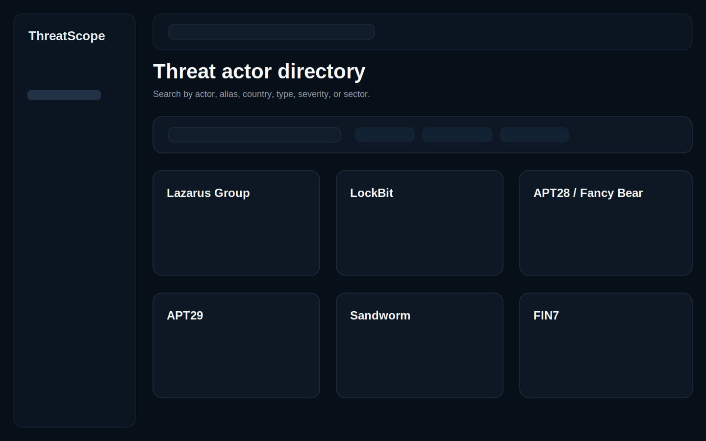
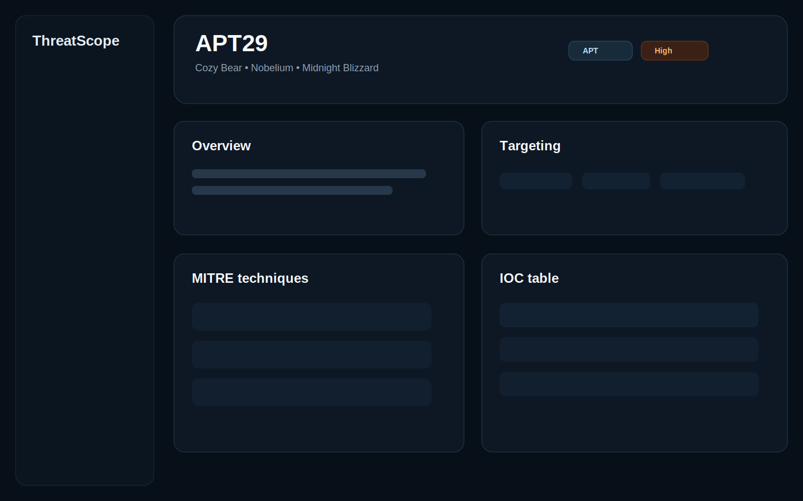
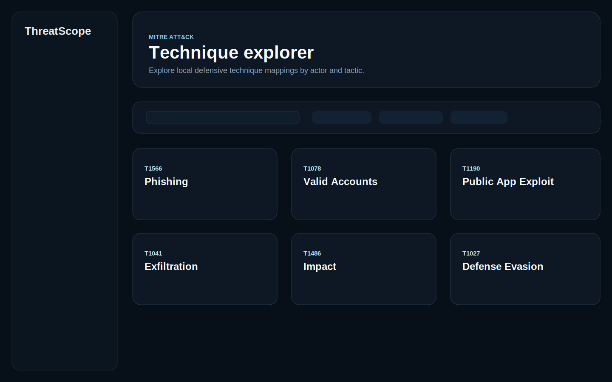

# ThreatScope

ThreatScope is a frontend-only cybersecurity threat intelligence dashboard built as a portfolio project. It presents a clean SOC-style interface for exploring threat actors, MITRE ATT&CK techniques, malware families, indicators of compromise, campaign timelines, and analyst detection notes.

The project uses safe local mock data only. It does not use real threat feeds, scraping, offensive tooling, exploit instructions, or production threat intelligence claims.

## Problem

Threat intelligence data is often fragmented across reports, actor profiles, technique mappings, and IOC lists. ThreatScope demonstrates how that information can be organized into a focused analyst dashboard that is searchable, structured, and easy to scan.

The goal is not to provide real intelligence. The goal is to show frontend engineering, cybersecurity domain understanding, information architecture, and defensive product thinking.

## Key Features

- Overview dashboard with analyst status, key metrics, actor type chart, and recent campaign preview
- Searchable and filterable threat actor directory
- Dynamic actor profile pages at `/actors/[slug]`
- MITRE ATT&CK explorer with tactic filtering
- Malware, IOC, campaign, and detection-note sections
- Static report detail pages for three mock intelligence briefs
- Responsive dark-mode SOC dashboard UI
- Local TypeScript mock data with realistic defensive terminology

## Tech Stack

- Next.js App Router
- TypeScript
- Tailwind CSS
- shadcn/ui-style local components
- lucide-react
- Recharts
- Framer Motion

## Screenshots

These screenshot references are stored in `public/screenshots` so they render in GitHub and can be replaced with captured production screenshots after deployment.

| Dashboard | Actor Directory |
| --- | --- |
|  |  |

| Actor Profile | ATT&CK Explorer |
| --- | --- |
|  |  |

## Routes

- `/` - overview dashboard
- `/actors` - searchable actor directory
- `/actors/[slug]` - full actor profile
- `/attack` - MITRE ATT&CK technique explorer
- `/reports` - static mock report index
- `/reports/[slug]` - static mock intelligence brief

## Run Locally

Install dependencies:

```bash
npm install
```

Start the development server:

```bash
npm run dev
```

Open:

```text
http://localhost:3000
```

Quality checks:

```bash
npm run lint
npm run build
npm audit --omit=dev
```

## Deploy To Vercel

ThreatScope is ready for Vercel as a frontend-only Next.js app.

1. Import the GitHub repository into Vercel.
2. Keep the framework preset as `Next.js`.
3. Use the default commands from `vercel.json`.
4. No environment variables are required.
5. Deploy from the `main` branch.

The app does not require a backend, database, authentication provider, external API keys, or scheduled jobs.

## Project Structure

```text
threatscope/
├── src/
│   ├── app/
│   │   ├── page.tsx
│   │   ├── layout.tsx
│   │   ├── globals.css
│   │   ├── actors/
│   │   │   ├── page.tsx
│   │   │   └── [slug]/
│   │   │       └── page.tsx
│   │   ├── attack/
│   │   │   └── page.tsx
│   │   └── reports/
│   │       ├── page.tsx
│   │       └── [slug]/
│   │           └── page.tsx
│   ├── components/
│   │   ├── actors/
│   │   ├── attack/
│   │   ├── dashboard/
│   │   ├── layout/
│   │   └── ui/
│   ├── data/
│   ├── lib/
│   └── types/
├── docs/
├── public/
│   └── screenshots/
├── README.md
├── package.json
├── vercel.json
└── tailwind.config.ts
```

## Cybersecurity Learning Goals

- Model threat actor profiles using structured TypeScript data
- Understand common threat intelligence concepts such as attribution, motivation, target sectors, IOCs, malware families, and campaigns
- Map actor behavior to MITRE ATT&CK-style techniques
- Design defensive SOC workflows around triage, search, and analyst context
- Communicate cybersecurity information without providing offensive operational detail

## What I Learned

- How to turn cybersecurity domain data into a usable dashboard experience
- How to design a multi-page Next.js App Router portfolio app
- How to structure local mock data for reusable UI components
- How to balance dashboard density with readability and responsiveness
- How to keep cybersecurity content defensive, educational, and safe for public display

## Future Roadmap

- Add deployed demo link
- Expand local report previews
- Add additional chart views from local data
- Improve visual QA across more viewport sizes
- Add optional local-only saved filter state
- Consider backend or external integrations only after the frontend MVP is stable

## Disclaimer

ThreatScope is a portfolio and learning project. It uses safe local mock data only.

It does not provide:

- Real threat intelligence feeds
- Production-ready threat intelligence
- Offensive tooling
- Exploit instructions
- Live indicators
- Scraping
- Backend collection
- Authentication or user accounts

All examples are defensive, educational, and designed for frontend portfolio demonstration.

## Documentation

- [Architecture](docs/architecture.md)
- [Data Model](docs/data-model.md)
- [Development Guide](docs/development.md)
- [Scope And Safety](docs/scope-and-safety.md)
